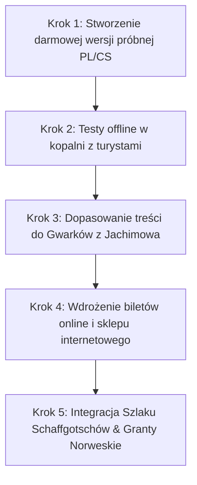

# Współpraca Partnerska: Cyfrowa Modernizacja i Rozwój Geoparku Krobica

---

### 1. Podsumowanie Menedżerskie (Executive Summary)

Niniejsza oferta to propozycja partnerskiego partnerstwa technologicznego pomiędzy **Geoparkiem Krobica (Kopalnia św. Jana)** a firmą **Future Solutions** (z siedzibą w sąsiednich Orłowicach). Naszym celem jest wprowadzenie kopalni w nowoczesną erę cyfrową, zwiększenie liczby odwiedzających z zagranicy oraz wygenerowanie nowych, trwałych źródeł przychodów.

Wychodząc naprzeciw specyficznym uwarunkowaniom technicznym i historycznym kopalni, proponujemy wdrożenie, które eliminuje problem braku zasięgu pod ziemią oraz opiera się na w pełni zweryfikowanej, lokalnej historii górnictwa.

---

### 2. Rozwiązanie Problemu: Aplikacja Offline „Walloon”

Kopalnie charakteryzują się ekstremalną wilgotnością, która niszczy fizyczne urządzenia elektroniczne (głośniki, tablety), oraz całkowitym brakiem zasięgu komórkowego pod ziemią. 

Proponujemy rozwiązanie oparte na **aplikacji mobilnej offline**:
*   **Pobieranie przed wejściem**: Turyści pobierają aplikację na własne telefony przy kasie biletowej (za pomocą szybkiego kodu QR i udostępnionego punktu Wi-Fi).
*   **Praca bez zasięgu**: Aplikacja zawiera gotowe, skompresowane pliki audio i opisy, które działają w 100% offline pod ziemią.
*   **Audio-Przewodnik w 4 Językach**: Turyści słyszą trasę po **Polsku, Niemiecku, Czesku i Angielsku**, co pozwala obcokrajowcom dołączać do standardowych grup prowadzonych przez polskiego przewodnika.
*   **Oko Walończyka (Skaner AI)**: Interaktywne narzędzie do rozpoznawania minerałów znalezionych na hałdach. Użytkownicy robią zdjęcie, a aplikacja rozpoznaje minerał i wyświetla jego historię oraz lokalne legendy.

---

### 3. Spójność Historyczna: Kierunek „Gwarkowie z Jachimowa”

W odpowiedzi na słuszne zastrzeżenia dotyczące zbyt mocnego promowania legend walońskich w tym rejonie, proponujemy **pełne dostosowanie treści historycznych aplikacji do lokalnej prawdy historycznej**:
*   **Baza merytoryczna**: Główny wątek narracji i kart kolekcjonerskich zostanie oparty na udokumentowanej historii **Gwarków z Jachimowa** (górników z Jáchymova), którzy odegrali kluczową rolę w rozwoju kopalń św. Jana i św. Leopolda.
*   **Edukacja i Legendy**: Legendy walońskie i alchemiczne (np. znaki walońskie, Koboldy) będą przedstawione jako dodatkowe tło mitologiczne, wyraźnie oddzielone od faktów historycznych.

---

### 4. Program Pilotowy: Wdrożenie Testowe bez Ryzyka (Quick Win)

Aby udowodnić skuteczność i stabilność technologii w trudnych warunkach kopalnianych, proponujemy **bezpłatną fazę testową**:
1.  **Darmowe przygotowanie pilota**: Future Solutions stworzy prostą, testową wersję aplikacji offline z przewodnikami audio w językach **Polskim i Czeskim**.
2.  **Testy w kopalni**: Wspólnie przetestujemy działanie aplikacji na telefonach turystów podczas zwiedzania.
3.  **Brak zobowiązań**: Kopalnia nie ponosi żadnych kosztów przygotowania i przeprowadzenia testów.

---

### 5. Model Finansowania: Wspólny Fundusz Technologiczny

Współpraca opiera się na partnerskim modelu podziału przychodów, eliminującym jakiekolwiek ryzyko finansowe po stronie kopalni:
*   **Zero inwestycji początkowej**: Future Solutions bierze na siebie 100% kosztów programowania, aktualizacji, zakupu API i hostingu.
*   **Model prowizyjny**: Przychody generowane przez mikropłatności w aplikacji (np. odblokowanie dodatkowych tras audio, skanerów premium lub zakup cyfrowych kart) oraz ze sklepu internetowego podlegają podziałowi procentowemu.
*   **Fundusz Cyfryzacji**: Część przychodów należna Future Solutions będzie odkładana na dedykowany **Fundusz Technologiczny Geoparku**. Z tych środków w pełni sfinansujemy:
    1.  **Nową stronę internetową** kopalniakrobica.pl (responsywną i nowoczesną).
    2.  **Automatyczny system rezerwacji biletów online** (eliminujący błędy w limitach grup i usprawniający rezerwacje dla przewodników).

---

### 6. Wizja Regionalna: Szlak Schaffgotschów i Fundusze Norweskie

Proponujemy wyjście poza ramy samej kopalni i stworzenie szerszego, regionalnego produktu turystycznego:
*   **Szlak Schaffgotschów**: Partnerstwo z **Gryfem Castle** (Zamek Gryf) oraz **Łukaszem Tekielą** (Dyrektorem Biblioteki Publicznej i Muzeum w Gryfowie Śląskim) w celu stworzenia zintegrowanego szlaku historyczno-turystycznego.
*   **Wspólny bilet i cross-selling**: Turyści odwiedzający Krobicę otrzymają zniżki na Zamek Gryf, a system rezerwacyjny będzie promował lokalne noclegi i atrakcje partnerskie.
*   **Fundusze Norweskie**: Posiadając patronat instytucjonalny (muzea, stowarzyszenia, LGD) oraz partnera technologicznego (Future Solutions), jesteśmy gotowi wspólnie aplikować o granty norweskie na ochronę dziedzictwa kulturowego i rozwój turystyki (nabory jesienne), wymagające bardzo niskiego wkładu własnego.

---

### 7. Plan Działania Krok po Kroku (Step-by-Step)

1.  **Krok 1 (Bieżący)**: Przygotowanie przez Future Solutions uproszczonej aplikacji offline (PL/CS) do testów.
2.  **Krok 2 (1-2 miesiące)**: Przeprowadzenie testów w kopalni, zebranie opinii od czeskich i polskich gości.
3.  **Krok 3 (2-3 miesiące)**: Dopracowanie tekstów, lektora i grafik we współpracy z lokalnymi historykami.
4.  **Krok 4 (3-6 miesięcy)**: Uruchomienie pełnego systemu sprzedaży biletów online oraz sklepu z pamiątkami (np. polerowane minerały wysyłane bezpośrednio z kopalni).
5.  **Krok 5 (Ponad 6 miesięcy)**: Rozpoczęcie wspólnych starań o dotacje unijne/norweskie oraz integracja systemów z Zamkiem Gryf i okolicznymi gminami.

---

### 📩 Kontakt i Weryfikacja Partnerska

Projekt realizowany jest lokalnie w celu wsparcia i promocji naszego regionu:

**Jan Fura &bull; Future Solutions**  
Siedziba: Orłowice, Dolny Śląsk  
Email: [jan@futuresolutionsjf.com](mailto:jan@futuresolutionsjf.com)  
www: [walloon.futuresolutionsai.com](https://walloon.futuresolutionsai.com)  

---
*Zbudujmy wspólnie nowoczesne i spójne historycznie oblicze Geoparku Krobica.*
